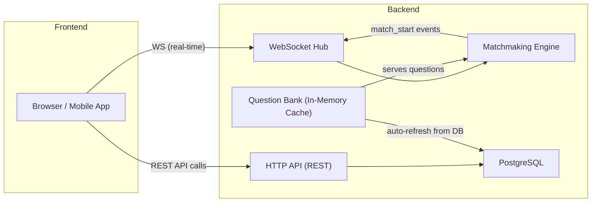
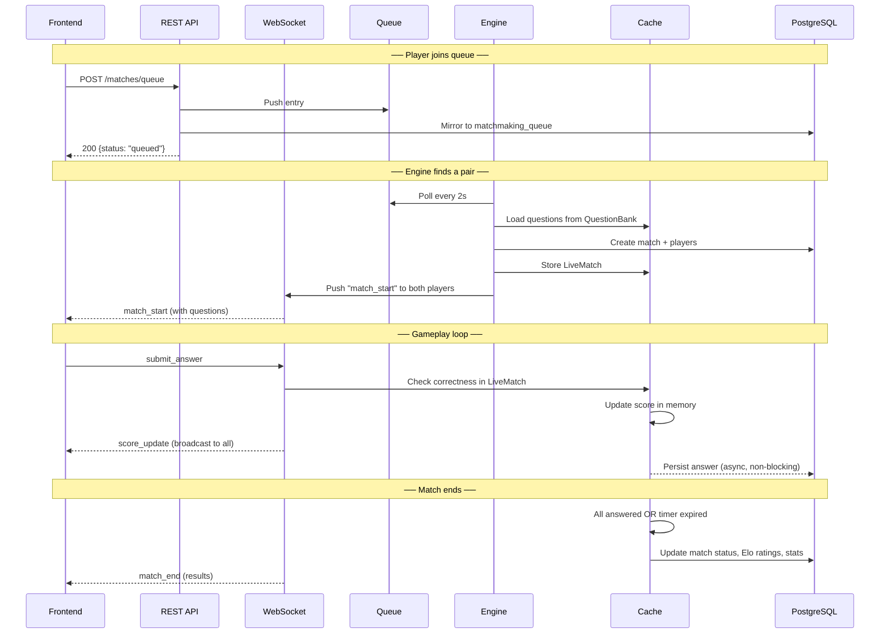

# Exam Arena — Frontend API Documentation

> Everything a frontend developer needs to build the UI without reading a single line of backend code.

---

## Table of Contents

1. [Architecture Overview](#1-architecture-overview)
2. [Base URL & Response Envelope](#2-base-url--response-envelope)
3. [Authentication](#3-authentication)
4. [REST API Endpoints](#4-rest-api-endpoints)
   - [Auth](#41-auth)
   - [Users](#42-users)
   - [Subjects / Categories](#43-subjects--categories)
   - [Matchmaking (Queue)](#44-matchmaking-queue)
   - [Matches](#45-matches)
   - [Friend Matches](#46-friend-matches)
   - [Practice Mode](#47-practice-mode)
   - [Leaderboard](#48-leaderboard)
   - [Admin](#49-admin-requires-admin-role)
   - [Health / Debug](#410-health--debug)
5. [WebSocket Protocol](#5-websocket-protocol)
   - [Connection](#51-connection)
   - [Client → Server Messages](#52-client--server-messages)
   - [Server → Client Messages](#53-server--client-messages)
6. [Data Models Reference](#6-data-models-reference)
7. [Game Rules & Scoring](#7-game-rules--scoring)
8. [How the System Maintains State](#8-how-the-system-maintains-state)
9. [Error Handling](#9-error-handling)
10. [Rate Limiting & CORS](#10-rate-limiting--cors)

---

## 1. Architecture Overview



### What the Backend Does

| Concern | How It Works |
|---|---|
| **Database** | PostgreSQL is the single source of truth. Every entity (users, matches, questions, ratings) lives here. |
| **In-Memory Cache** | A question bank pre-loads all published questions from DB, refreshes every 15 minutes. Match state also lives in memory during gameplay. |
| **Matchmaking** | An in-memory queue pools players by `(exam_category, match_type)`. An engine goroutine polls the queue every 2 seconds, pairs players within ±200 rating points (expanding over time), and kicks off matches. |
| **Live Match State** | When a match starts, a `LiveMatch` struct is stored in the cache. All answer-checking and scoring happens in memory (zero DB calls during gameplay). Results are flushed to Postgres when the match ends. |
| **WebSocket** | A single persistent WS connection per user. The Hub routes messages to/from players. All real-time events (match start, score updates, timer ticks, match end) flow through WS. |
| **Elo Rating** | Standard Elo formula (K=32). Ratings are per-user per-exam-category. Default rating = 1200. |

---

## 2. Base URL & Response Envelope

**Base URL:** `http://localhost:8080` (default, configurable via `SERVER_HOST` / `SERVER_PORT`)

**All REST responses** follow this envelope:

```json
{
  "success": true,
  "data": { /* actual response payload */ },
  "error": "",
  "meta": { /* optional pagination/extra info */ }
}
```

| Field | Type | Description |
|---|---|---|
| `success` | `boolean` | `true` for 2xx status codes, `false` otherwise |
| `data` | `object \| array \| null` | The response payload (absent on errors) |
| `error` | `string` | Error message (absent on success) |
| `meta` | `object \| null` | Pagination info, category, etc. (only on some endpoints) |

---

## 3. Authentication

### How it works

- The backend uses **JWT (HS256)** tokens.
- Tokens contain: `user_id`, `username`, `role`, `exp`, `iat`.
- Default expiry: **24 hours** (configurable).

### For REST endpoints

Send the token in the `Authorization` header:

```
Authorization: Bearer <JWT_TOKEN>
```

### For WebSocket

Browsers can't set custom headers on WS handshake. Send the token as a **query parameter**:

```
ws://host/ws?token=<JWT_TOKEN>
```

### JWT Token Payload (decoded)

```json
{
  "user_id": "uuid-string",
  "username": "john_doe",
  "role": "user",
  "exp": 1700000000,
  "iat": 1699913600
}
```

### Roles

| Role | Permissions |
|---|---|
| `user` | All regular endpoints (matches, practice, leaderboard, profile) |
| `admin` | Everything above + admin endpoints (create/publish questions, system stats) |
| `moderator` | Defined in schema but not yet enforced in middleware |

---

## 4. REST API Endpoints

> [!NOTE]
> 🔒 = Requires `Authorization: Bearer <token>` header
> 👑 = Requires `admin` role

---

### 4.1 Auth

#### `POST /api/v1/auth/register`

Register a new user account.

**Request Body:**
```json
{
  "username": "john_doe",
  "email": "john@example.com",
  "password": "securepass123"
}
```

**Validation Rules:**
- `username`: 3–30 characters, must be unique (case-insensitive)
- `email`: must contain `@`, must be unique (case-insensitive)
- `password`: minimum 8 characters

**Success Response:** `201 Created`
```json
{
  "success": true,
  "data": {
    "token": "eyJhbGciOiJIUzI1NiIs...",
    "user": {
      "id": "550e8400-e29b-41d4-a716-446655440000",
      "username": "john_doe",
      "email": "john@example.com",
      "display_name": null,
      "avatar_url": null,
      "country_code": null,
      "preferred_language": "en",
      "role": "user",
      "status": "active",
      "email_verified_at": null,
      "last_login_at": null,
      "created_at": "2026-09-09T15:00:00Z",
      "updated_at": "2026-09-09T15:00:00Z"
    }
  }
}
```

**Error Responses:**
| Status | Error | Reason |
|---|---|---|
| `400` | `"username must be between 3 and 30 characters"` | Invalid username length |
| `400` | `"password must be at least 8 characters"` | Password too short |
| `400` | `"invalid email address"` | Missing `@` in email |
| `400` | `"username already taken"` | Duplicate username |
| `400` | `"email already registered"` | Duplicate email |

---

#### `POST /api/v1/auth/login`

Authenticate with username/email and password.

**Request Body:**
```json
{
  "login": "john_doe",
  "password": "securepass123"
}
```

> [!TIP]
> The `login` field accepts **either** a username or email address. The backend auto-detects which one it is based on whether it contains `@`.

**Success Response:** `200 OK`
```json
{
  "success": true,
  "data": {
    "token": "eyJhbGciOiJIUzI1NiIs...",
    "user": {
      "id": "550e8400-e29b-41d4-a716-446655440000",
      "username": "john_doe",
      "email": "john@example.com",
      "display_name": null,
      "avatar_url": null,
      "country_code": null,
      "preferred_language": "en",
      "role": "user",
      "status": "active",
      "email_verified_at": null,
      "last_login_at": "2026-09-09T15:00:00Z",
      "created_at": "2026-09-09T15:00:00Z",
      "updated_at": "2026-09-09T15:00:00Z"
    }
  }
}
```

**Error Responses:**
| Status | Error |
|---|---|
| `401` | `"invalid credentials"` |
| `401` | `"account is not active"` |

---

#### `GET /api/v1/auth/me` 🔒

Get the currently authenticated user's profile.

**Success Response:** `200 OK`
```json
{
  "success": true,
  "data": {
    "id": "550e8400-...",
    "username": "john_doe",
    "email": "john@example.com",
    "display_name": null,
    "avatar_url": null,
    "country_code": null,
    "preferred_language": "en",
    "role": "user",
    "status": "active",
    "email_verified_at": null,
    "last_login_at": "2026-09-09T15:00:00Z",
    "created_at": "2026-09-09T15:00:00Z",
    "updated_at": "2026-09-09T15:00:00Z"
  }
}
```

---

### 4.2 Users

#### `GET /api/v1/users/{id}`

Get a user's public profile and their ratings per exam category.

**Path Parameters:**
| Param | Type | Description |
|---|---|---|
| `id` | `UUID` | User ID |

**Success Response:** `200 OK`
```json
{
  "success": true,
  "data": {
    "user": {
      "id": "550e8400-...",
      "username": "john_doe",
      "display_name": "John Doe",
      "avatar_url": "https://...",
      "country_code": "IN",
      "preferred_language": "en",
      "role": "user",
      "status": "active",
      "created_at": "2026-09-09T15:00:00Z",
      "updated_at": "2026-09-09T15:00:00Z"
    },
    "ratings": [
      {
        "user_id": "550e8400-...",
        "exam_category_id": "cat-uuid-ssc",
        "rating": 1342,
        "matches_played": 15,
        "updated_at": "2026-09-09T14:00:00Z"
      }
    ]
  }
}
```

---

#### `GET /api/v1/users/{id}/stats`

Get a user's detailed statistics per exam category.

**Success Response:** `200 OK`
```json
{
  "success": true,
  "data": [
    {
      "user_id": "550e8400-...",
      "exam_category_id": "cat-uuid-ssc",
      "total_matches": 25,
      "wins": 15,
      "losses": 8,
      "draws": 2,
      "current_win_streak": 3,
      "longest_win_streak": 7,
      "longest_losing_streak": 3,
      "total_questions_solved": 250,
      "total_practice_sessions": 10,
      "overall_accuracy": 72.50,
      "avg_solving_time_ms": 15000
    }
  ]
}
```

---

#### `GET /api/v1/users/{id}/matches`

Get a user's match history.

> [!WARNING]
> This endpoint is currently a **stub** — it returns a placeholder message. Implementation is pending.

**Success Response:** `200 OK`
```json
{
  "success": true,
  "data": {
    "message": "match history endpoint"
  }
}
```

---

### 4.3 Subjects / Categories

#### `GET /api/v1/subjects` 🔒

Get all active exam categories (subjects) available for matchmaking and practice.

**Success Response:** `200 OK`
```json
{
  "success": true,
  "data": [
    {
      "id": "cat-uuid-ssc",
      "code": "SSC",
      "name": "SSC CGL",
      "description": "Staff Selection Commission Combined Graduate Level",
      "is_active": true
    },
    {
      "id": "cat-uuid-banking",
      "code": "BANKING",
      "name": "Banking Exams",
      "description": "IBPS PO, SBI PO, RBI Grade B",
      "is_active": true
    }
  ]
}
```

> [!IMPORTANT]
> The `id` (UUID) from this response is what you pass as `exam_category_id` to matchmaking, practice, and friend match endpoints. The `code` (e.g., `"SSC"`) is what you pass to the leaderboard endpoint.

---

### 4.4 Matchmaking (Queue)

#### `POST /api/v1/matches/queue` 🔒

Join the matchmaking queue. The server will automatically pair you with a similar-rated opponent and start a match via WebSocket.

**Request Body:**
```json
{
  "exam_category_id": "cat-uuid-ssc",
  "match_type": "ranked"
}
```

| Field | Type | Required | Description |
|---|---|---|---|
| `exam_category_id` | `UUID` | ✅ | The category to queue for |
| `match_type` | `string` | ❌ | Defaults to `"ranked"`. Options: `ranked`, `arena`, `daily_challenge` |

**Success Response:** `200 OK`
```json
{
  "success": true,
  "data": {
    "status": "queued",
    "message": "waiting for an opponent"
  }
}
```

> [!TIP]
> After receiving this response, listen on your WebSocket connection for a `match_start` message. The matchmaking engine polls every 2 seconds and pairs players within ±200 Elo (expanding ±50 every 10 seconds of wait time).

---

#### `DELETE /api/v1/matches/queue` 🔒

Leave the matchmaking queue.

**Success Response:** `200 OK`
```json
{
  "success": true,
  "data": {
    "status": "removed from queue"
  }
}
```

---

#### `GET /api/v1/matches/queue/stats` 🔒

Get live queue depth per matchmaking pool.

**Success Response:** `200 OK`
```json
{
  "success": true,
  "data": {
    "pools": {
      "SSC:ranked": 5,
      "BANKING:ranked": 2
    }
  }
}
```

---

### 4.5 Matches

#### `GET /api/v1/matches/{id}` 🔒

Get full match details. If the match is still in progress, includes live scores from the in-memory cache and the player-safe question list (no correct answers).

**Path Parameters:**
| Param | Type | Description |
|---|---|---|
| `id` | `UUID` | Match ID |

**Success Response:** `200 OK`

For an **in-progress** match:
```json
{
  "success": true,
  "data": {
    "match": {
      "id": "match-uuid",
      "match_type": "ranked",
      "status": "in_progress",
      "exam_category_id": "cat-uuid-ssc",
      "timer_seconds": 120,
      "max_players": 2,
      "created_at": "2026-09-09T15:00:00Z",
      "started_at": "2026-09-09T15:00:05Z",
      "ended_at": null
    },
    "players": [
      {
        "id": "player-uuid",
        "match_id": "match-uuid",
        "user_id": "user-uuid-a",
        "username": "john_doe",
        "score": 250,
        "final_rank": null,
        "rating_before": 1342,
        "rating_after": null,
        "rating_delta": null,
        "connection_status": "connected",
        "joined_at": "2026-09-09T15:00:05Z"
      }
    ],
    "questions": [
      {
        "id": "q-uuid-1",
        "question_type": "mcq_single",
        "difficulty": "medium",
        "body": "What is the capital of India?",
        "estimated_time_seconds": 60,
        "order_index": 1,
        "options": [
          { "id": "opt-uuid-1", "option_text": "Mumbai", "order_index": 1 },
          { "id": "opt-uuid-2", "option_text": "New Delhi", "order_index": 2 },
          { "id": "opt-uuid-3", "option_text": "Kolkata", "order_index": 3 },
          { "id": "opt-uuid-4", "option_text": "Chennai", "order_index": 4 }
        ]
      }
    ],
    "live_scores": [
      {
        "user_id": "user-uuid-a",
        "username": "john_doe",
        "score": 250,
        "questions_answered": 2,
        "correct": 2
      },
      {
        "user_id": "user-uuid-b",
        "username": "jane_smith",
        "score": 100,
        "questions_answered": 1,
        "correct": 1
      }
    ]
  }
}
```

For a **completed** match, `questions` and `live_scores` will be `null`/absent. The `players` array will contain final `rating_after`, `rating_delta`, and `final_rank`.

---

### 4.6 Friend Matches

#### `POST /api/v1/matches/friend` 🔒

Create a private friend match room. Returns a 6-character room code to share.

**Request Body:**
```json
{
  "exam_category_id": "cat-uuid-ssc"
}
```

**Success Response:** `201 Created`
```json
{
  "success": true,
  "data": {
    "match_id": "match-uuid",
    "room_code": "ABC123",
    "status": "waiting",
    "message": "share the room code with your friend"
  }
}
```

> [!TIP]
> The room code uses characters `A-Z` (excluding I and O) + `2-9` (excluding 0 and 1) to avoid ambiguity. Share this code with your friend out-of-band.

---

#### `POST /api/v1/matches/friend/join` 🔒

Join an existing friend match room. When the second player joins, the match starts automatically and both players receive a `match_start` WebSocket message.

**Request Body:**
```json
{
  "room_code": "ABC123"
}
```

**Success Response:** `200 OK`
```json
{
  "success": true,
  "data": {
    "match_id": "match-uuid",
    "status": "in_progress",
    "message": "match is starting — listen on your WebSocket connection"
  }
}
```

**Error Responses:**
| Status | Error |
|---|---|
| `400` | `"room \"XYZ\" not found or already started"` |
| `400` | `"you are already in this room"` |
| `400` | `"room is full"` |

---

### 4.7 Practice Mode

Practice mode lets users answer questions without affecting their rating.

#### `POST /api/v1/practice/start` 🔒

Start a new practice session.

**Request Body:**
```json
{
  "exam_category_id": "cat-uuid-ssc",
  "topic_id": "topic-uuid-or-null",
  "difficulty": "medium",
  "question_count": 10
}
```

| Field | Type | Required | Description |
|---|---|---|---|
| `exam_category_id` | `UUID` | ✅ | Category to practice |
| `topic_id` | `UUID \| null` | ❌ | Optional topic filter |
| `difficulty` | `string \| null` | ❌ | `"easy"`, `"medium"`, or `"hard"`. Null = mixed |
| `question_count` | `int` | ❌ | 1–50, defaults to 10 |

**Success Response:** `201 Created`
```json
{
  "success": true,
  "data": {
    "session_id": "session-uuid",
    "questions": [
      {
        "id": "q-uuid-1",
        "question_type": "mcq_single",
        "difficulty": "medium",
        "body": "What is 2+2?",
        "estimated_time_seconds": 60,
        "order_index": 1,
        "options": [
          { "id": "opt-1", "option_text": "3", "order_index": 1 },
          { "id": "opt-2", "option_text": "4", "order_index": 2 },
          { "id": "opt-3", "option_text": "5", "order_index": 3 },
          { "id": "opt-4", "option_text": "22", "order_index": 4 }
        ]
      }
    ]
  }
}
```

---

#### `POST /api/v1/practice/{id}/answer` 🔒

Submit an answer for a question in a practice session. **Returns immediate feedback** (correct/incorrect + explanation).

**Path Parameters:**
| Param | Type | Description |
|---|---|---|
| `id` | `UUID` | Practice session ID |

**Request Body:**
```json
{
  "question_id": "q-uuid-1",
  "option_id": "opt-2",
  "time_taken_ms": 5432
}
```

**Success Response:** `200 OK`
```json
{
  "success": true,
  "data": {
    "is_correct": true,
    "explanation": "2+2 equals 4 by basic addition."
  }
}
```

> [!NOTE]
> Unlike live matches (where answer correctness is hidden from the opponent), practice mode **immediately reveals** whether the answer is correct and shows the question's explanation (if available).

---

#### `POST /api/v1/practice/{id}/end` 🔒

End a practice session early (mark as completed).

**Success Response:** `200 OK`
```json
{
  "success": true,
  "data": {
    "status": "completed"
  }
}
```

---

#### `GET /api/v1/practice/{id}` 🔒

Get practice session details.

**Success Response:** `200 OK`
```json
{
  "success": true,
  "data": {
    "id": "session-uuid",
    "user_id": "user-uuid",
    "exam_category_id": "cat-uuid-ssc",
    "topic_id": null,
    "difficulty": "medium",
    "question_count": 10,
    "status": "in_progress"
  }
}
```

---

### 4.8 Leaderboard

#### `GET /api/v1/leaderboard/{category}`

Get the leaderboard for an exam category. **Does not require authentication.**

**Path Parameters:**
| Param | Type | Description |
|---|---|---|
| `category` | `string` | Category **code** (e.g., `SSC`, `BANKING`). Not the UUID! |

**Query Parameters:**
| Param | Type | Default | Description |
|---|---|---|---|
| `limit` | `int` | `50` | Number of entries (max 100) |
| `offset` | `int` | `0` | Pagination offset |

**Success Response:** `200 OK`
```json
{
  "success": true,
  "data": [
    {
      "rank": 1,
      "user_id": "user-uuid-1",
      "username": "top_player",
      "display_name": "Top Player",
      "avatar_url": "https://...",
      "rating": 1850,
      "matches_played": 120
    },
    {
      "rank": 2,
      "user_id": "user-uuid-2",
      "username": "second_best",
      "display_name": null,
      "avatar_url": null,
      "rating": 1790,
      "matches_played": 95
    }
  ],
  "meta": {
    "limit": 50,
    "offset": 0,
    "category": "SSC"
  }
}
```

> [!TIP]
> Leaderboard data is cached for **1 minute**. The cache is invalidated whenever a match ends and ratings are updated.

---

### 4.9 Admin (Requires `admin` role)

#### `POST /api/v1/admin/questions` 🔒👑

Create a new question (status: `draft`).

**Request Body:**
```json
{
  "exam_category_id": "cat-uuid-ssc",
  "topic_id": "topic-uuid",
  "question_type": "mcq_single",
  "difficulty": "medium",
  "body": "What is the largest planet in our solar system?",
  "explanation": "Jupiter is the largest planet.",
  "estimated_time_seconds": 60,
  "options": [
    { "option_text": "Mars", "is_correct": false },
    { "option_text": "Jupiter", "is_correct": true },
    { "option_text": "Saturn", "is_correct": false },
    { "option_text": "Neptune", "is_correct": false }
  ]
}
```

| Field | Type | Required | Default |
|---|---|---|---|
| `exam_category_id` | `UUID` | ✅ | — |
| `topic_id` | `UUID` | ✅ | — |
| `question_type` | `string` | ❌ | `"mcq_single"` |
| `difficulty` | `string` | ✅ | — |
| `body` | `string` | ✅ | — |
| `explanation` | `string \| null` | ❌ | `null` |
| `estimated_time_seconds` | `int` | ❌ | `60` |
| `options` | `array` | ✅ | — (min 2) |

**Question Types:** `mcq_single`, `mcq_multiple`, `integer`

**Difficulty Levels:** `easy`, `medium`, `hard`

**Success Response:** `201 Created` — Returns the full created question object with generated IDs.

---

#### `PUT /api/v1/admin/questions/{id}/publish` 🔒👑

Publish a draft question (makes it available for matches and practice).

**Success Response:** `200 OK`
```json
{
  "success": true,
  "data": {
    "status": "published"
  }
}
```

> [!NOTE]
> Published questions will appear in the in-memory Question Bank within 15 minutes (the auto-refresh interval).

---

#### `GET /api/v1/admin/stats` 🔒👑

Get system-wide statistics.

**Success Response:** `200 OK`
```json
{
  "success": true,
  "data": {
    "users": 1250,
    "questions": 5000,
    "active_matches": 12,
    "total_matches": 8500
  }
}
```

---

### 4.10 Health / Debug

#### `GET /health`

Health check endpoint. No auth required.

**Response:** `200 OK`
```json
{
  "status": "ok",
  "online": 42,
  "queue": {
    "SSC:ranked": 5,
    "BANKING:ranked": 2
  }
}
```

> [!NOTE]
> This endpoint does **not** use the standard API response envelope. It returns raw JSON.

---

## 5. WebSocket Protocol

### 5.1 Connection

**URL:** `ws://localhost:8080/ws?token=<JWT_TOKEN>`

The server authenticates via the `token` query parameter. On successful connection, you'll receive:

```json
{
  "type": "connected",
  "payload": {
    "user_id": "550e8400-...",
    "username": "john_doe",
    "message": "connected to Exam Arena"
  }
}
```

> [!IMPORTANT]
> The Hub enforces **single-session per user**. If the same user connects again, the previous connection is forcefully closed.

---

### 5.2 Client → Server Messages

All messages must be JSON with this shape:

```json
{
  "type": "<message_type>",
  "payload": { /* type-specific data */ }
}
```

#### `submit_answer`

Submit an answer during a live match.

```json
{
  "type": "submit_answer",
  "payload": {
    "match_id": "match-uuid",
    "question_id": "q-uuid-1",
    "option_id": "opt-uuid-2",
    "time_taken_ms": 4321
  }
}
```

| Field | Type | Required | Description |
|---|---|---|---|
| `match_id` | `UUID` | ✅ | The match you're in |
| `question_id` | `UUID` | ✅ | The question being answered |
| `option_id` | `UUID` | ✅ | The selected option (empty string = skipped) |
| `time_taken_ms` | `int` | ✅ | Time taken to answer (clamped to 0–300,000ms) |

> [!NOTE]
> - Duplicate answers for the same question are silently ignored (idempotent).
> - The response is **not** sent back directly — instead, a `score_update` is broadcast to **all** players in the match, including the sender.

---

#### `ping`

Measure latency to the server.

```json
{
  "type": "ping",
  "payload": {}
}
```

Response:
```json
{
  "type": "pong",
  "payload": {
    "server_time": "ok"
  }
}
```

---

### 5.3 Server → Client Messages

These are pushed to your WebSocket connection by the server.

#### `connected`

Sent immediately after a successful WS handshake.

```json
{
  "type": "connected",
  "payload": {
    "user_id": "user-uuid",
    "username": "john_doe",
    "message": "connected to Exam Arena"
  }
}
```

---

#### `match_start`

Sent when a match begins (either from matchmaking queue or friend match).

```json
{
  "type": "match_start",
  "payload": {
    "match_id": "match-uuid",
    "match_type": "ranked",
    "timer_seconds": 120,
    "questions": [
      {
        "id": "q-uuid-1",
        "question_type": "mcq_single",
        "difficulty": "medium",
        "body": "What is the capital of France?",
        "estimated_time_seconds": 60,
        "order_index": 1,
        "options": [
          { "id": "opt-1", "option_text": "London", "order_index": 1 },
          { "id": "opt-2", "option_text": "Paris", "order_index": 2 },
          { "id": "opt-3", "option_text": "Berlin", "order_index": 3 },
          { "id": "opt-4", "option_text": "Madrid", "order_index": 4 }
        ]
      }
    ],
    "players": [
      { "user_id": "user-a-uuid", "username": "player_a", "rating": 1342 },
      { "user_id": "user-b-uuid", "username": "player_b", "rating": 1298 }
    ]
  }
}
```

> [!IMPORTANT]
> The `questions` array does **NOT** include `is_correct` on options — correct answers are stripped out to prevent cheating.

---

#### `score_update`

Broadcast to all players in a match every time someone answers a question.

```json
{
  "type": "score_update",
  "payload": {
    "match_id": "match-uuid",
    "user_id": "user-a-uuid",
    "question_id": "q-uuid-1",
    "is_correct": true,
    "points_earned": 150,
    "scoreboard": [
      {
        "user_id": "user-a-uuid",
        "username": "player_a",
        "score": 400,
        "questions_answered": 3,
        "correct": 3
      },
      {
        "user_id": "user-b-uuid",
        "username": "player_b",
        "score": 200,
        "questions_answered": 2,
        "correct": 2
      }
    ]
  }
}
```

---

#### `time_update`

Broadcast every **10 seconds** during a match with the remaining time.

```json
{
  "type": "time_update",
  "payload": {
    "match_id": "match-uuid",
    "remaining_seconds": 80
  }
}
```

---

#### `match_end`

Sent when the match ends (either all questions answered or timer expired).

```json
{
  "type": "match_end",
  "payload": {
    "match_id": "match-uuid",
    "results": [
      {
        "user_id": "user-a-uuid",
        "username": "player_a",
        "score": 800,
        "rank": 1,
        "correct": 7,
        "total": 10
      },
      {
        "user_id": "user-b-uuid",
        "username": "player_b",
        "score": 550,
        "rank": 2,
        "correct": 5,
        "total": 10
      }
    ]
  }
}
```

---

#### `match_failed`

Sent if a match could not be started (e.g., not enough questions for the category).

```json
{
  "type": "match_failed",
  "payload": {
    "reason": "not enough questions available for this category"
  }
}
```

---

#### `error`

Sent when a client message is invalid or cannot be processed.

```json
{
  "type": "error",
  "payload": {
    "message": "match_id and question_id are required",
    "match_id": "match-uuid"
  }
}
```

---

## 6. Data Models Reference

### User

```typescript
interface User {
  id: string;              // UUID
  username: string;
  email?: string;          // hidden in some contexts
  display_name: string | null;
  avatar_url: string | null;
  country_code: string | null;  // ISO 3166-1 alpha-2 (e.g., "IN", "US")
  preferred_language: string;   // default "en"
  role: "user" | "admin" | "moderator";
  status: "active" | "suspended" | "banned" | "deleted";
  email_verified_at: string | null;   // ISO 8601
  last_login_at: string | null;       // ISO 8601
  created_at: string;                 // ISO 8601
  updated_at: string;                 // ISO 8601
}
```

### UserRating

```typescript
interface UserRating {
  user_id: string;
  exam_category_id: string;
  rating: number;           // default 1200 (Elo)
  matches_played: number;
  updated_at: string;
}
```

### UserStatistics

```typescript
interface UserStatistics {
  user_id: string;
  exam_category_id: string;
  total_matches: number;
  wins: number;
  losses: number;
  draws: number;
  current_win_streak: number;
  longest_win_streak: number;
  longest_losing_streak: number;
  total_questions_solved: number;
  total_practice_sessions: number;
  overall_accuracy: number;      // percentage (0.00 – 100.00)
  avg_solving_time_ms: number | null;
}
```

### ExamCategory

```typescript
interface ExamCategory {
  id: string;           // UUID — pass as exam_category_id to most endpoints
  code: string;         // Short code ("SSC", "BANKING") — pass to leaderboard
  name: string;
  description: string;
  is_active: boolean;
}
```

### Match

```typescript
interface Match {
  id: string;
  match_type: "ranked" | "friend" | "arena" | "tournament" | "daily_challenge";
  status: "waiting" | "starting" | "in_progress" | "completed" | "abandoned" | "cancelled";
  exam_category_id: string;
  room_code?: string;        // only for friend matches
  tournament_id?: string;
  timer_seconds: number;     // 120 default
  max_players: number;       // 2 for 1v1
  created_at: string;
  started_at: string | null;
  ended_at: string | null;
}
```

### QuestionForPlayer (safe — no correct answer)

```typescript
interface QuestionForPlayer {
  id: string;
  question_type: "mcq_single" | "mcq_multiple" | "integer";
  difficulty: "easy" | "medium" | "hard";
  body: string;
  estimated_time_seconds: number;
  order_index: number;
  options: OptionForPlayer[];
}

interface OptionForPlayer {
  id: string;
  option_text: string;
  order_index: number;
  // NOTE: is_correct is intentionally ABSENT
}
```

### LeaderboardEntry

```typescript
interface LeaderboardEntry {
  rank: number;
  user_id: string;
  username: string;
  display_name: string | null;
  avatar_url: string | null;
  rating: number;
  matches_played: number;
}
```

### WebSocket Message

```typescript
interface WSMessage {
  type: string;
  payload?: Record<string, any>;
}
```

---

## 7. Game Rules & Scoring

| Rule | Value |
|---|---|
| Questions per match | **10** |
| Match timer | **120 seconds** (2 minutes) |
| Points per correct answer | **100** |
| Time bonus (answered in < 10s) | **+50** |
| Time bonus (answered in < 30s) | **+25** |
| Time bonus (answered in ≥ 30s) | **+0** |
| Max possible score per question | **150** (100 + 50 bonus) |
| Max possible match score | **1500** |
| Default Elo rating | **1200** |
| Elo K-factor | **32** |
| Matchmaking rating window | **±200** (expands ±50 every 10s) |
| Timer updates sent every | **10 seconds** |
| Match ends when | All players answer all questions **OR** timer expires |

### Scoring Formula

```
points = 0
if answer_is_correct:
    points = 100
    if time_taken < 10s:
        points += 50    # fast bonus
    elif time_taken < 30s:
        points += 25    # moderate bonus
```

### Elo Rating Update

After each **ranked** match, both players' ratings are adjusted using standard Elo:

```
Expected_A = 1 / (1 + 10^((Rating_B - Rating_A) / 400))
New_Rating_A = Rating_A + K * (Score_A - Expected_A)
```

Where `Score_A` is 1.0 (win), 0.5 (draw), or 0.0 (loss).

> [!NOTE]
> **Friend matches also update Elo ratings.** Rating changes happen asynchronously after the match ends.

---

## 8. How the System Maintains State

### State Flow Diagram



### Key Design Decisions

1. **Zero DB calls during gameplay** — All answer checking and scoring uses the in-memory `LiveMatch` struct. DB writes happen asynchronously.

2. **Queue is in-memory, mirrored to DB** — The in-memory queue is authoritative for speed. Postgres gets a best-effort mirror so the queue can be rebuilt after a server restart.

3. **Question Bank is pre-warmed** — All published questions are loaded into memory at startup and refreshed every 15 minutes. Matches never hit the DB for questions.

4. **Single WebSocket per user** — If a user opens a new connection, the old one is killed. Handle reconnection gracefully on the frontend.

5. **Leaderboard is cached** — Leaderboard queries are cached for 1 minute. Cache is invalidated when any match ends.

---

## 9. Error Handling

### REST Error Response Format

```json
{
  "success": false,
  "error": "descriptive error message"
}
```

### Common HTTP Status Codes

| Code | When |
|---|---|
| `200` | Success |
| `201` | Resource created (register, create match, start practice) |
| `400` | Bad request (validation error, missing fields, business logic error) |
| `401` | Missing or invalid JWT token |
| `403` | Insufficient permissions (non-admin trying admin endpoints) |
| `404` | Resource not found (user, match, session) |
| `500` | Internal server error |

### WebSocket Error Message

```json
{
  "type": "error",
  "payload": {
    "message": "human-readable error message",
    "match_id": "optional-context-id"
  }
}
```

---

## 10. Rate Limiting & CORS

### Rate Limiting

- **Default**: 100 requests/second per IP, burst of 200
- Configurable via `RATE_LIMIT_RPS` and `RATE_LIMIT_BURST` env vars
- Applied globally to all endpoints

### CORS

- `Access-Control-Allow-Origin`: `*` (all origins)
- `Access-Control-Allow-Methods`: `GET, POST, PUT, DELETE, OPTIONS`
- `Access-Control-Allow-Headers`: `Content-Type, Authorization`
- `Access-Control-Max-Age`: `86400` (24 hours)
- Preflight `OPTIONS` requests return `204 No Content`

> [!WARNING]
> CORS is currently wide open (`*`). This should be restricted to your frontend domain in production.

---

## Quick Reference: Endpoint Summary

| Method | Path | Auth | Description |
|---|---|---|---|
| `POST` | `/api/v1/auth/register` | ❌ | Register new user |
| `POST` | `/api/v1/auth/login` | ❌ | Login |
| `GET` | `/api/v1/auth/me` | 🔒 | Get current user |
| `GET` | `/api/v1/users/{id}` | ❌ | Get user profile + ratings |
| `GET` | `/api/v1/users/{id}/stats` | ❌ | Get user statistics |
| `GET` | `/api/v1/users/{id}/matches` | ❌ | Get match history (stub) |
| `GET` | `/api/v1/subjects` | 🔒 | List exam categories |
| `POST` | `/api/v1/matches/queue` | 🔒 | Join matchmaking queue |
| `DELETE` | `/api/v1/matches/queue` | 🔒 | Leave matchmaking queue |
| `GET` | `/api/v1/matches/queue/stats` | 🔒 | Queue depth per pool |
| `GET` | `/api/v1/matches/{id}` | 🔒 | Get match details |
| `POST` | `/api/v1/matches/friend` | 🔒 | Create friend match room |
| `POST` | `/api/v1/matches/friend/join` | 🔒 | Join friend match room |
| `POST` | `/api/v1/practice/start` | 🔒 | Start practice session |
| `POST` | `/api/v1/practice/{id}/answer` | 🔒 | Submit practice answer |
| `POST` | `/api/v1/practice/{id}/end` | 🔒 | End practice session |
| `GET` | `/api/v1/practice/{id}` | 🔒 | Get practice session |
| `GET` | `/api/v1/leaderboard/{category}` | ❌ | Leaderboard by category code |
| `POST` | `/api/v1/admin/questions` | 🔒👑 | Create question |
| `PUT` | `/api/v1/admin/questions/{id}/publish` | 🔒👑 | Publish question |
| `GET` | `/api/v1/admin/stats` | 🔒👑 | System statistics |
| `GET` | `/health` | ❌ | Health check |
| `GET` | `/ws?token=<JWT>` | 🔒 (via query) | WebSocket connection |
